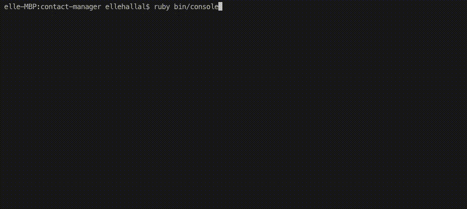

# Contact Manager

A Ruby command line application, which allows the user to store (in a JSON file), search and view their contacts.

- [Contact Manager](#contact-manager)
  - [Preview](#preview)
  - [Features](#features)
  - [Install](#install)
  - [Testing](#testing)
      - [Running Tests](#running-tests)
  - [To Do](#to-do)
  - [Related Blog Posts](#related-blog-posts)

## Preview



## Features

- The user can:
  - Add a new contact (first name, last name, email, phone number)
  - View a list of their contacts
  - Sort contacts alphabetically by first name, last name and email address
  - Search for a contact by first name, last name, email, or phone number and view their details
  - Edit and delete a contact
- All contacts are saved in a JSON file ( `./lib/contacts.json`) and loads when the application starts
- The output displays in different colours
- The UI is static

## Install

Note: if you don't have Ruby installed, you can find instructions [here](https://www.ruby-lang.org/en/documentation/installation/).

```
git clone https://github.com/itsellej/ruby_contact_manager.git
cd ruby-contact-manager
ruby bin/console
```

## Testing

All classes are tested using RSpec.

#### Running Tests

To run all tests, in the terminal, type: `rspec`

To run tests for individual classes: `rspec spec/[name of test file]`

## To Do

- Implement the methods in the Validation class to check user's input
- Condense methods to adhere to the [single responsibility principle](https://en.wikipedia.org/wiki/Single_responsibility_principle)
- Extract methods which interact with the JSON file to a separate class
- Test output of selection options available in the ContactManager class
- Create a mock JSON file for tests
- Experiment with storing contacts in a database

## Related Blog Posts
Blog posts published to [Medium](https://medium.com/@ellehallal/) during the creation of Contact Manager:
- [Testing input with Rspec & an intro to JSON](https://medium.com/@ellehallal/week-4-testing-input-with-rspec-an-intro-to-json-4354ade41900)